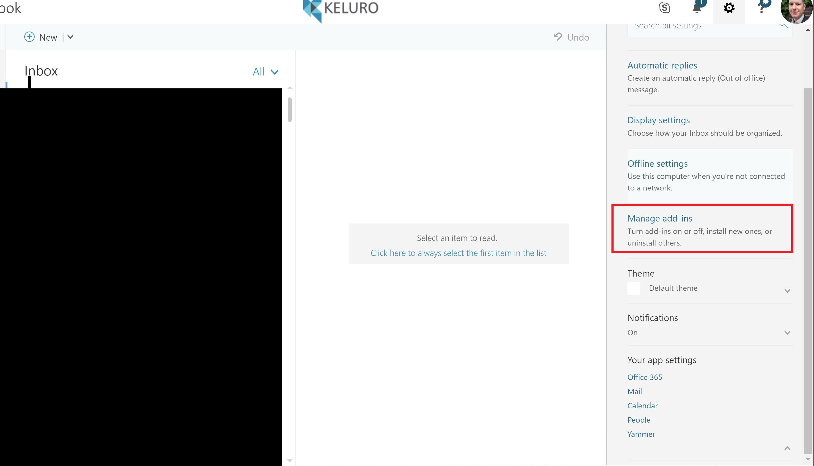
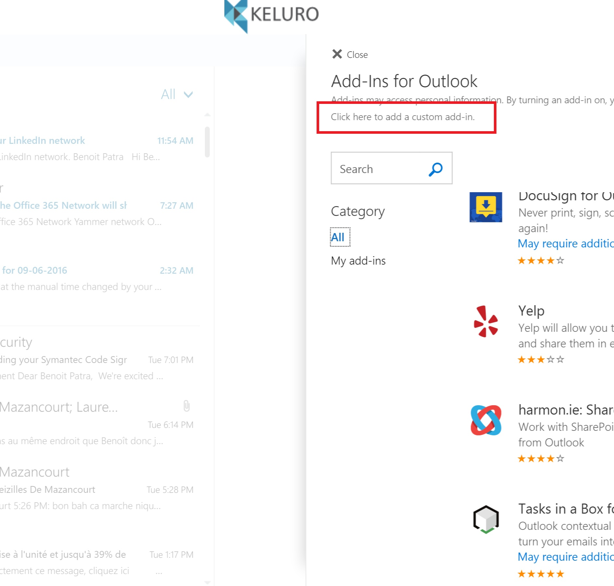

# How to start locally the server.

## Open the web app directly
- Make sure you have Visual Studio 2015.

- Open *Office365WebAppAddinSignInSample.sln* and Build the solution. You should not have to build the typescript. The generated typescript is already under version control. *Sorry but I cannot write plain old javascript any longer...*

- Start the Web project by hitting F5.

- Now you should be abled to log-in in the web app by browsing *https://localhost:44301* (by pass browser security warning about the self signed certificate). Note that, if you use the default Azure AD application provided when checkouting this repository, then you have to use port 44301 to serve your website locally.

## Open the add-in

- Make sure the local server is still running and serving on port 44301.
- Open your Office 365 OWA (Outlook Web Access) at *mail.office365.com*

- Go to *Options (gear icon) > Manage add-ins* and click *Click here to add custom add-ins* 

 

- Now you should be able to browse the *add-in* (named **KSample**)!
 