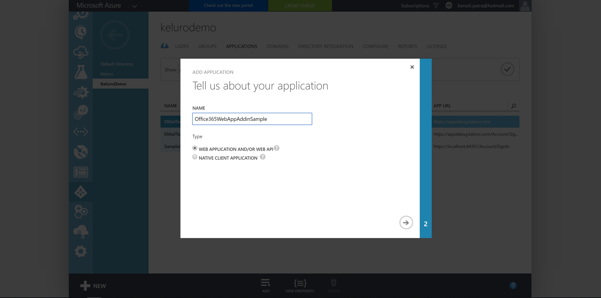
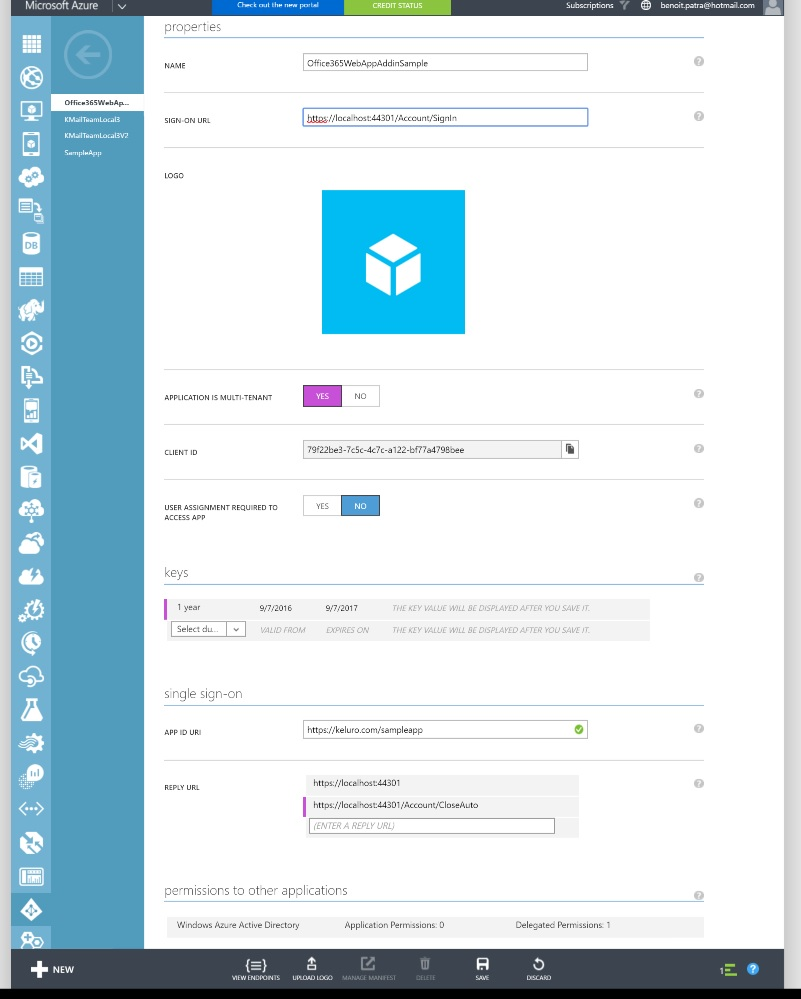
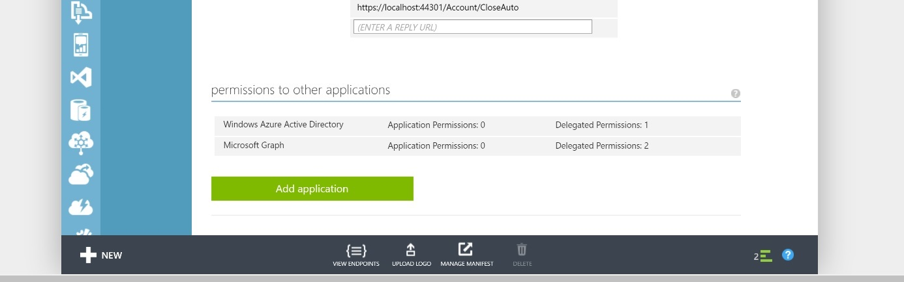

# Create the Azure AD application

The two web apps are actually one app for Azure AD. Keluro developers gave you a multi-tenant Azure AD application so that you can work directly. Here are the instructions to create your own Azure AD app that works with this sample.

- Go to manage.windowsazure.com (old portal)
- Select the proper Azure AD directory and click *Add* to create a new web application (Azure AD does not care if you will consume it with two differents web apps).  

- On the sign on url enter *https://localhost/Account/SignIn* and for the appid uri the url of your ad followed by the name of the application (e.g. https://mykelurodemo.onmicrosoft.com/Office365Sample)

- When the app is created go to the *Configure* menu.
Make sure your app is multitenant. Add the two reply urls:
*https://localhost:44301* and *https://localhost:44301/Account/CloseAuto*

- Add the Azure Graph API in *permissions to other applications*. Select *View user basic profile* and *Sign in and read user profile*. 
