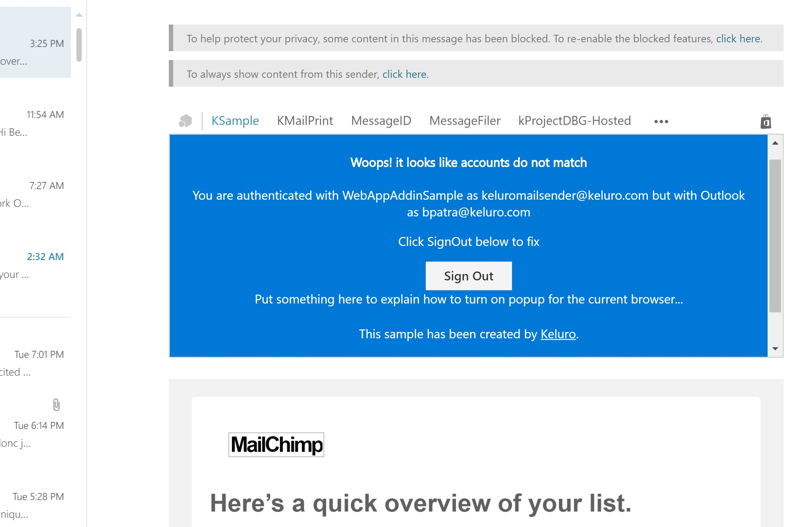
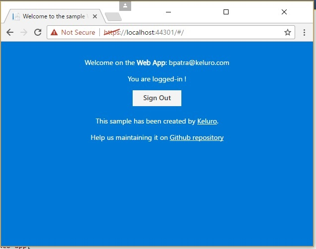
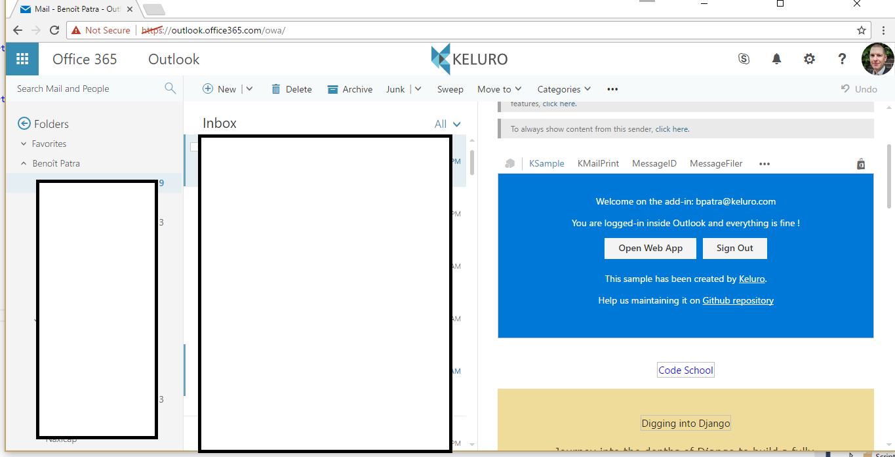
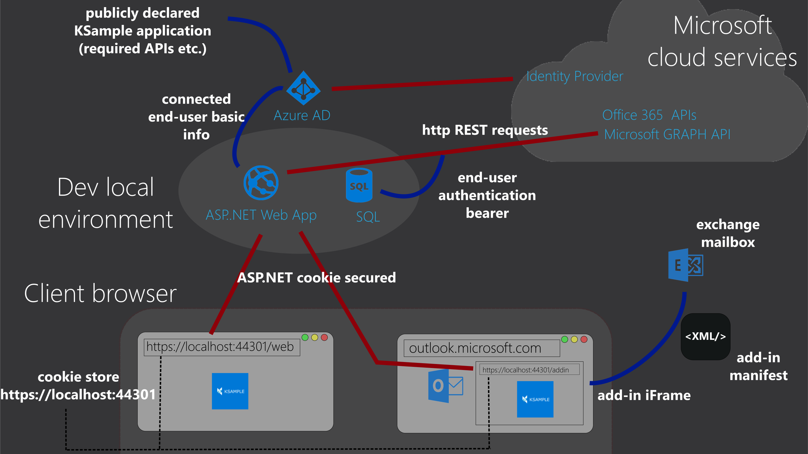

# A sample that leverages the technicalities of Sign-In for Outlook Web Add-ins and Multi-tenant Office 365 Web apps.

Another sample for social logins with Office add-ins is available [here](https://github.com/dougperkes/Office-Add-in-AspNetMvc-ServerAuth). 

## What is provided by this sample

- An Office add-in may need access to Office 365 APIs and identity. The new Office "web" add-ins are web apps, the proper way to do this is through an [Azure AD](https://azure.microsoft.com/en-us/documentation/articles/active-directory-whatis/) registration. As explained in this [blog post](https://blogs.msdn.microsoft.com/richard_dizeregas_blog/2015/08/10/connecting-to-office-365-from-an-office-add-in/), we may need a popup to achieve this. To overcome this problem Microsoft created the [dialogApi](https://channel9.msdn.com/Shows/Office-Dev-Show/Office-Dev-Show-Episode-26-Using-the-Dialog-API-in-Office-Add-ins). This sample provides a functional solution using the **dialogApi** when available and the popup/SignalR technique as a fallback.

- Your solution may not be simply just the Outlook add-in but also a standalone web app secured by Office 365 and Azure AD. This is the case for **Keluro - Smart Email Sharing** where we have the [add-in](https://store.office.com/en-us/app.aspx?assetid=WA104380149&ui=en-US&rs=en-US&ad=US&appredirect=false) and the [Office 365 web-app](https://store.office.com/en-us/app.aspx?assetid=SA000000070&ui=en-US&rs=en-US&ad=US&appredirect=false). This sample shows a way to share the authentication scheme for a better user experience.

- Some situations are handled in this sample: for example, the following one. When you login/logoff with different accounts, you can end up with a situation where the add-in the identity your are logged in with Outlook may not match the one your authenticated with the Office 365 web app. The sample handles this (see screenshot)

- Most of the new Extension point provided for Outlook add-ins are supported. Such as the [Outlook Modules](http://dev.office.com/docs/add-ins/outlook/extension-module-outlook-add-ins), we display the web app in modules. 

- You can see how the Azure Graph API can be requested. See method *GetMailUserInfo()* in class **ConnectedUserProvider.cs**

## Two Single Page applications served by Asp.net

In this sample there are two Single Page Applications (written with Angular.js 1): the add-in and the web app. The server side code is written in C#/ASP.NET (both MVC and WebAPI)

## Technical information

- [Get started with local environment (and the default Azure AD web app provided by Keluro)](Docs/GetStarted.md).
- [How to register my own Azure AD application for this.](Docs/MyOwnAzureAD.md)

The following picture is an overview of how the sample works when run locally from your dev machine. We use a basic ASP.NET cookie for the authentication between application server and the clients. We request the APIs by using [ADAL](https://azure.microsoft.com/en-us/documentation/articles/active-directory-authentication-libraries/) and a token saved in our SQL Server database.

